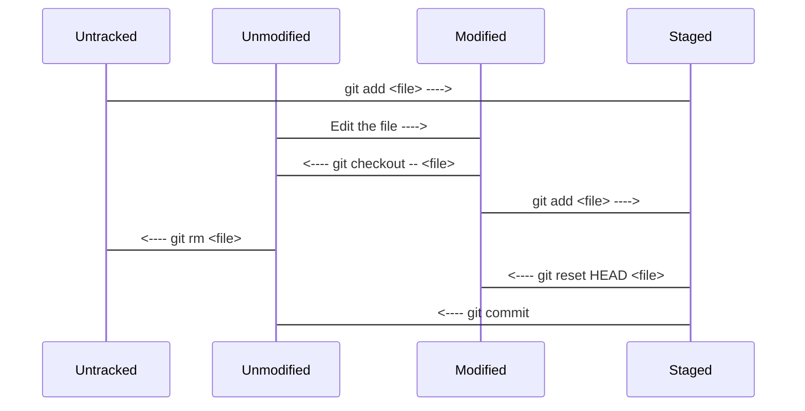

[Tig](https://jonas.github.io/tig/) is an ncurses-based text-mode interface for git. It functions mainly as a Git repository browser, but can also assist in staging changes for commit at chunk level and act as a pager for output from various Git commands.

<!--more-->

I have used tig for several months and have great experience with it. Tig is extremely fast and can easily integrate into my terminal based development environment. Moreover, the status view in Tig is a killing feature, which allow user to manage files between different git status easily without remember complex git command. 

This post will cover different views of Tig and many useful commands.

## Install

MacOS: `$ brew install tig --HEAD`

Linux: `$ sudo apt install tig`

## Views & Commands

**History view (main view) (m):** 

Is the default view, and it shows a one line summary of each commit in the chosen list of revisions.

*shift + c* : do a cherry pick when you curse on one commit in this view.

**Diff view (d):**

Shows either the diff of the current working tree, that is, what has changed since the last commit, or the commit diff complete with log message, diffstat and diff.

*u*: stage one change block.

*1*: stage single diff line.

**File(blob) view (f):**

Displays the file content or "blob" of data associated with a file name.

**Blame view (s):**

Displays the file content annotated or blamed by commits.

**Status view (s):** 

Displays status of files in the working tree and allows changes to be staged/unstaged as well as adding of untracked files.

*shift + c*: create a commit and edit commit message in default editor.

## Git File Status

A file in a git repository have 4 status: untracked, unmodified, modifies, staged. Their relationship is shown below: 

We can easily manage file across these status under **status view** in git with the following command:

*u*: stage a untracked file or modified file.

*u*: un-stage a staged file back to untracked or modified.

*!*: revert a staged/modified file to unmodified.

## Tips

1. Set default editor in macos: `export EDITOR="/usr/local/Cellar/neovim/0.3.1/bin/nvim"`
2. Customize tig configuration: `~/.tigrc`.

## Reference
1. [Tig cheatsheet](https://devhints.io/tig)

2. [Tig Manual](https://jonas.github.io/tig/doc/manual.html)
